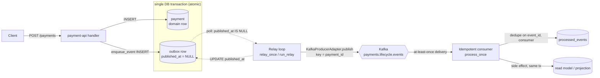

# Architecture

Start here to orient before touching code (CLAUDE.md §13).

The canonical design lives in [CLAUDE.md](../CLAUDE.md): the lifecycle state machine (§2),
the core principles — Kafka-only inter-service events, append-only ledger, transactional
outbox, typed contracts, idempotent consumers (§3) — and the repository layout (§5).

This document will expand as services land. For now it is a pointer; the contract is law.

## Transactional outbox (as implemented in `libs/common`)

The outbox exists to kill the **dual-write bug**: "write my row, then publish to Kafka" can
fail between the two steps, leaving a row with no event (or an event with no row). We never
publish from a request handler (CLAUDE.md §3.3, §12). Instead the domain row and an outbox
row are written in **one DB transaction**, and a separate relay publishes committed rows.

Implementing functions: `enqueue_event` + `OutboxRecord`
([outbox.py](../libs/common/src/intellipay/common/outbox.py)), `relay_once` / `run_relay`
([relay.py](../libs/common/src/intellipay/common/relay.py)), `KafkaProducerAdapter`
([kafka.py](../libs/common/src/intellipay/common/kafka.py)), and on the consume side
`process_once` + `ProcessedEvent`
([idempotency.py](../libs/common/src/intellipay/common/idempotency.py)).

### Sequence (the temporal guarantees)

```mermaid
sequenceDiagram
    autonumber
    participant C as Client
    participant H as payment-api handler
    participant DB as Postgres
    participant R as Relay (polling loop)
    participant K as Kafka
    participant Co as Idempotent consumer

    Note over H,DB: ONE transaction — atomic
    C->>H: POST /payments
    activate H
    H->>DB: BEGIN
    H->>DB: INSERT payment (domain row)
    H->>DB: enqueue_event() → INSERT outbox row (published_at = NULL)
    H->>DB: COMMIT
    H-->>C: 202 Accepted
    deactivate H

    loop run_relay: poll until stopped
        R->>DB: SELECT outbox WHERE published_at IS NULL<br/>(FOR UPDATE SKIP LOCKED on Postgres)
        alt rows pending
            R->>K: publish(topic, key=payment_id, value, headers)
            R->>DB: UPDATE published_at = now() ; COMMIT
            Note over R,DB: publish FIRST, mark SECOND →<br/>crash between = replay (at-least-once)
        else nothing pending
            R->>R: sleep(poll_interval)
        end
    end

    K->>Co: deliver event (at-least-once — may be a duplicate)
    activate Co
    Note over Co,DB: process_once — ONE transaction
    Co->>DB: already_processed(event_id, consumer)?
    alt first time
        Co->>DB: handler side effect (same tx)
        Co->>DB: mark_processed() → INSERT (event_id, consumer)
        Co->>DB: COMMIT
    else duplicate
        Co->>Co: skip (no-op)
    end
    deactivate Co
```

### Components (the trust boundary)



### Why it holds

- **Atomic emit.** `enqueue_event` only `session.add`s — it never commits. It joins the
  handler's transaction, so the domain row and outbox row commit together or not at all. A
  rollback discards the event too.
- **At-least-once, never zero.** The relay publishes *then* marks `published_at`. A crash in
  between re-publishes the row next pass — duplicates are possible, lost events are not. For
  money, that's the correct failure direction.
- **Exactly-once *effect*.** The consumer absorbs those duplicates: `process_once` runs the
  side effect and inserts `(event_id, consumer)` in one transaction; the composite primary
  key makes a second apply impossible, and the pre-check just avoids wasted work.
- **Swappable relay.** The relay depends only on a `Producer` protocol and the outbox table,
  so Debezium CDC can later replace the polling loop without touching the write side.

> Note: the producer side (handler + relay) is wired into a running service in Slice 4; the
> consume side (`process_once`) is implemented and unit-tested in `libs/common` and is wired
> into `payment-api`'s self-consuming reference loop in Slice 4.
